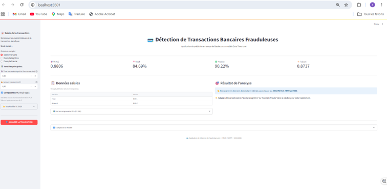
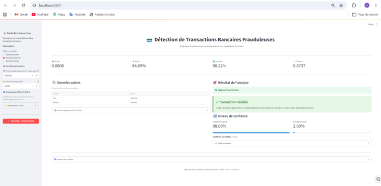
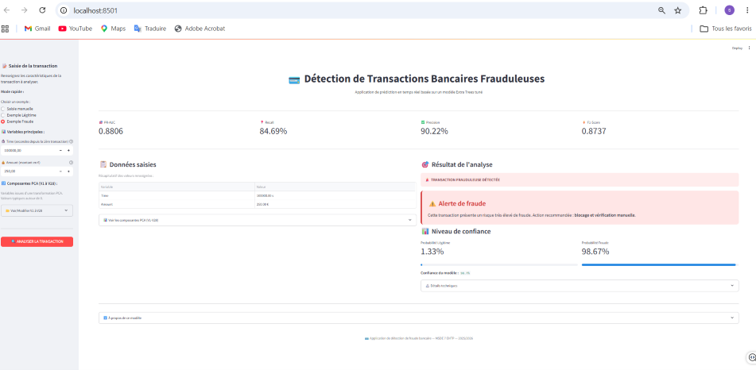

#  Détection de Transactions Bancaires Frauduleuses

**Projet Machine Learning — MSDE 7 (EHTP)**  
**Module 5 :** Machine Learning  
**Auteurs :**  FANANE SARA & MOUNIR MARIA 
**Année académique :** 2025/2026

---

##  Application déployée

 **[Accéder à l'application Streamlit](https://VOTRE-LIEN-STREAMLIT.streamlit.app)**


---

##  Description du projet

Ce projet construit un **modèle de Machine Learning** capable de détecter les transactions bancaires frauduleuses sur cartes de crédit, à partir du dataset *Credit Card Fraud Detection* (Kaggle, septembre 2013).

### Contexte métier

La fraude par carte de crédit représente un enjeu majeur pour les institutions financières. Selon le *Nilson Report 2023*, les pertes mondiales atteignent **34 milliards de dollars par an**. Le défi est double :
- **Détecter un maximum de fraudes** pour limiter les pertes financières.
- **Limiter les fausses alertes** pour préserver l'expérience client.

### Caractéristiques du dataset

| Caractéristique | Valeur |
|-----------------|--------|
| Nombre de transactions | 284 807 |
| Nombre de features | 31 |
| Fraudes | 492 (0.172%) |
| Variables interprétables | Time, Amount |
| Variables PCA | V1 à V28 |

---

##  Méthodologie

1. **EDA** — analyse du déséquilibre extrême
2. **Preprocessing**
   - RobustScaler (Amount, Time)
   - Feature Selection (SelectKBest + RF Importance)
   - SMOTE sur train uniquement
3. **11 algorithmes ML comparés** (linéaires, ensemblistes, boosting)
4. **Tuning RandomizedSearchCV** sur le Top 3
5. **Modèle final** : Extra Trees tuné
6. **Sérialisation** du pipeline complet (joblib + compression)
7. **Déploiement** sur Streamlit Cloud

### Métriques retenues

Compte tenu du déséquilibre extrême (0.172% de fraudes), les métriques classiques sont inadaptées. Métriques retenues :
- **PR-AUC** — métrique principale, adaptée aux datasets déséquilibrés
- **G-Mean** — métrique de contrôle

---

##  Résultats finaux

Le modèle **Extra Trees tuné** atteint sur le test set :

| Métrique | Valeur |
|----------|--------|
| **PR-AUC** | **0.8806** |
| **Recall** | **84.69%** |
| **Precision** | **90.22%** |
| **F1-Score** | **0.8737** |
| **G-Mean** | **0.9202** |

**Performance opérationnelle :**
-  **83 fraudes détectées sur 98** dans le test set
-  Seulement **10 fausses alertes** sur 56 864 transactions légitimes
-  Taux de fausses alertes : **0.018%**

---

##  Structure du dépôt

```
.
├── README.md                          # Ce fichier
├── requirements.txt                   # Dépendances Python
├── app.py                             # Application Streamlit
├── fraud_detection_pipeline.pkl       # Pipeline sérialisé (~40 MB)
├── notebook.ipynb                     # Notebook complet
├── rapport.pdf                        # Rapport détaillé
└── screenshots/
    ├── home.png
    ├── prediction_legitime.png
    └── prediction_fraude.png
```

---

##  Installation et utilisation locale

### 1. Cloner le dépôt
```bash
git clone https://github.com/fananesara2-web/Projet_DETECTION_FRAUDE_SF_MM.git
cd Projet_DETECTION_FRAUDE_SF_MM
```

### 2. Installer les dépendances
```bash
pip install -r requirements.txt
```

### 3. Lancer l'application
```bash
streamlit run app.py
```

L'application sera accessible sur **http://localhost:8501**

---

##  Captures d'écran

### Page d'accueil


### Prédiction d'une transaction légitime


### Prédiction d'une transaction frauduleuse


---

##  Technologies utilisées

| Catégorie | Outils |
|-----------|--------|
| **Langage** | Python 3.9+ |
| **Manipulation données** | pandas, numpy |
| **Visualisation** | matplotlib, seaborn |
| **ML** | scikit-learn, xgboost, lightgbm, catboost |
| **Rééquilibrage** | imbalanced-learn (SMOTE) |
| **Sérialisation** | joblib |
| **Application web** | Streamlit |
| **Déploiement** | Streamlit Cloud |
| **Versioning** | Git, GitHub |

---

## Algorithmes comparés (AXE 4)

| # | Algorithme | Famille | PR-AUC |
|---|------------|---------|--------|
| 1 | Extra Trees | Bagging | **0.879** |
| 2 | Random Forest | Bagging | 0.868 |
| 3 | XGBoost | Boosting | 0.867 |
| 4 | LightGBM | Boosting | 0.844 |
| 5 | CatBoost | Boosting | 0.825 |
| 6 | AdaBoost | Boosting | 0.771 |
| 7 | Logistic Regression | Linéaire | 0.724 |
| 8 | Gradient Boosting | Boosting | 0.711 |
| 9 | KNN | À base d'instances | 0.610 |
| 10 | Decision Tree | Arbre | 0.286 |
| 11 | Naive Bayes | Probabiliste | 0.084 |

---

##  Références bibliographiques

1. Dal Pozzolo, A., et al. (2015). *Credit card fraud detection: A realistic modeling and a novel learning strategy*. IEEE Transactions on Neural Networks and Learning Systems.
2. Chawla, N. V., et al. (2002). *SMOTE: Synthetic Minority Over-sampling Technique*. JAIR.
3. Chen, T., & Guestrin, C. (2016). *XGBoost: A scalable tree boosting system*. KDD'16.
4. Saito, T., & Rehmsmeier, M. (2015). *The precision-recall plot is more informative than the ROC plot when evaluating binary classifiers on imbalanced datasets*. PLOS ONE.

